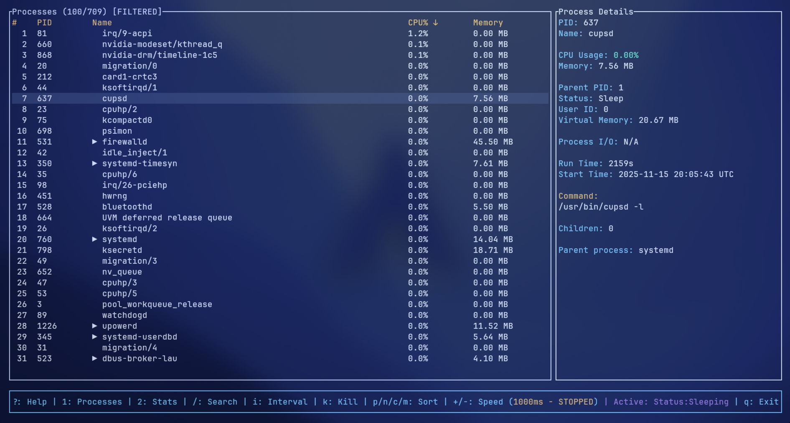
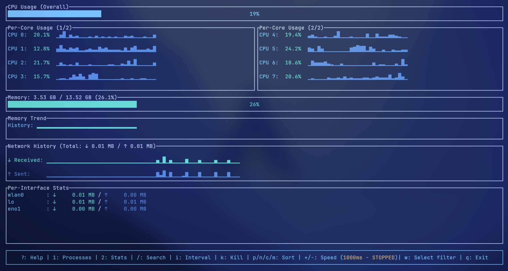

# RTOP

A fast, terminal-based system monitoring tool built with **Rust** and **ratatui**.

---




## Prerequisites

- **Linux** (Windows compatibility hasn't been added yet)
- **Rust** (v1.80+ recommended) and Cargo → [Install Rust](https://www.rust-lang.org/tools/install)
- **Git** (to clone the repository)

---

## Installation

### 1. Clone the repository

```bash
git clone https://github.com/Lucop1911/rtop.git
cd rtop
````

### 2. Build the app from source

```bash
cargo build --release
```

The compiled binary will be located at:

```
target/release/rtop
```

### 3. Install the binary

You can move the binary to a directory included in your `$PATH`.

```bash
chmod +x target/release/rtop
mv target/release/rtop ~/.local/bin/
```

**Recommended paths:**

* `~/.local/bin` → user only
* `/usr/local/bin` → system-wide (requires `sudo`)

After this, you can run the app from anywhere:

```bash
rtop
```

---

## Updating

To update rtop:

```bash
git pull
cargo build --release
```

Then replace the existing binary in your installation path.

---

## License

This project is licensed under the **Apache License 2.0**.
See [LICENSE](LICENSE) for details.
